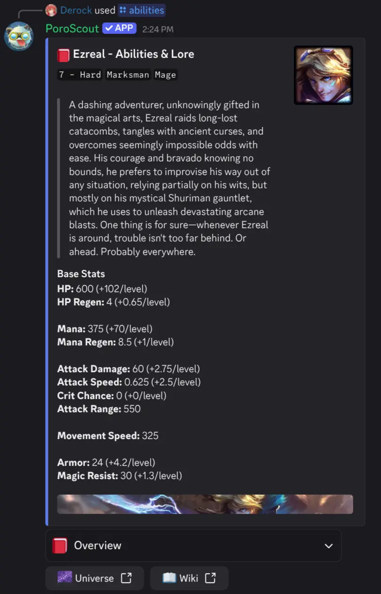

The overview page gives a brief on the champion's lore and base stats: HP, HP regen, mana, mana regen, attack damage, attack speed, crit chance, attack range, movement speed, armor, and magic resist.

Use the select menu at the bottom of the embed to switch between sections: **Overview**, the **Q / W / E / R** abilities, the champion's **Passive**, and **Tips**.

Each ability section (Q, W, E, R and Passive) includes:

- The **name** of the ability.
- The **description** of the ability.
- **Cooldown** and mana / resource cost, if applicable.
- **Scaling** information.
- Any **active effects or passives** for the ability.

The tips section provides some general advice on how to play against or as the champion.

## Usage

```text
/abilities champion:<champion>
```

| Option     | Required | Description                                          |
| ---------- | -------- | ---------------------------------------------------- |
| `champion` | Yes      | The champion to look up (autocompletes as you type). |

## Example



## Extra information

Champions with multiple forms (e.g. Nidalee, Aphelios) get multiple embeds per ability, one for each form, so you can see the full kit in every stance.

## Tips

- For builds, runes and win rates instead, use [`/champion`](/docs/commands/champion).
- Links at the bottom of the embed give you quick access to the fandom and League universe pages.
