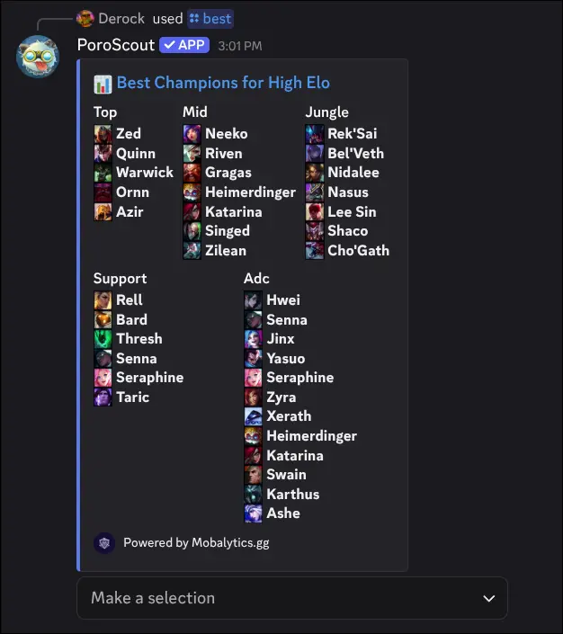

`/best` shows a tier list of the strongest champions by role. By default, it gives you a five-column overview with the top S-tier picks (falling back to A-tier if S is sparse) for each lane. You can then drill into a specific role for the full ranked breakdown.

## What it shows

The default view shows all five roles side by side: Top, Jungle, Mid, ADC, and Support. Each column lists the highest-rated champions with their champion icons.

When you select a role (either via the `role` option or the dropdown in a server), you get the full tier breakdown for that lane, organized from highest to lowest tier. Champions in each tier are listed with their icons and names.

The embed includes a link to the full Mobalytics tier list page.

### Role dropdown

When PoroScout is used inside a server (not DMs), a select menu appears below the embed. You can switch between roles without running the command again. The menu is only usable by the person who ran the command.

## Usage

```text
/best
/best elo:<High Elo | Low Elo>
/best elo:<High Elo | Low Elo> role:<role>
```

| Option | Required | Description                                                        |
| ------ | -------- | ------------------------------------------------------------------ |
| `elo`  | No       | Whether to show High Elo or Low Elo data. Defaults to High Elo.    |
| `role` | No       | Jump straight to a specific role (Top, Jungle, Mid, ADC, Support). |

High Elo and Low Elo represent two different slices of the ranked ladder. The best champions in Challenger can look very different from those that dominate in Gold and Silver, so the option exists to view both perspectives.

## Example



## Tips

- For a single champion's detailed stats and build, use [`/champion`](/docs/commands/champion).
- For who counters a specific champion, use [`/counters`](/docs/commands/counters).
- Data is sourced from [Mobalytics.gg](https://mobalytics.gg) and updates with each patch.
