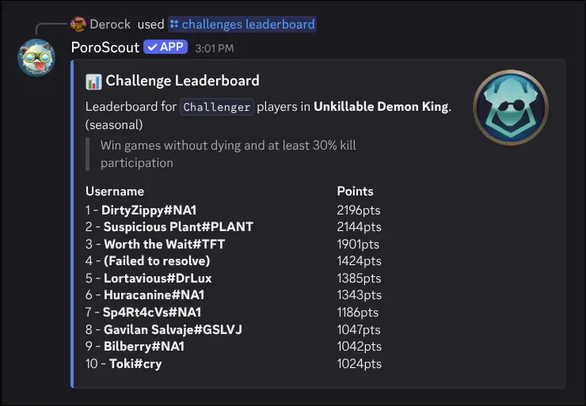

`/challenges` has two subcommands: `leaderboard` for checking who is at the top of a specific challenge, and `stats` for viewing what challenges a player has completed.

## Leaderboard

```text
/challenges leaderboard region:<region> challenge:<challenge> level:<level>
```

Shows the top 10 players in a specific challenge at a given tier.

| Option      | Required | Description                                                |
| ----------- | -------- | ---------------------------------------------------------- |
| `region`    | Yes      | The region to pull the leaderboard from.                   |
| `challenge` | Yes      | The challenge to view. Autocompletes as you type.          |
| `level`     | Yes      | The tier to filter by: Master, Grandmaster, or Challenger. |

The embed shows:

- A description and short description of the challenge.
- Whether it is a **lifetime** or **seasonal** challenge.
- The thumbnail icon for the challenge at the selected tier.
- Up to 10 players ranked by their point total. If there is a next tier above the selected one, points are shown as a fraction of the threshold needed to reach it (for example, `4,200 / 5,000 (84%)`).

Not all challenges have leaderboards. If you select one that does not, the command will let you know.

## Stats

```text
/challenges stats
/challenges stats username:<RiotID#Tag> region:<region>
/challenges stats username:<RiotID#Tag> region:<region> challenge:<challenge>
```

Shows the challenge breakdown for a specific player.

| Option      | Required | Description                                                                              |
| ----------- | -------- | ---------------------------------------------------------------------------------------- |
| `username`  | No       | The Riot ID to look up. Leave blank to use your [linked account](/docs/linked-accounts). |
| `region`    | No       | The region the account is in. Required if providing a username without a link.           |
| `challenge` | No       | A specific challenge to get detailed info on.                                            |

**Without a specific challenge**, the embed lists all challenges the player has progressed in, grouped by tier from highest to lowest (Challenger down to Iron). Each group shows the challenge names they have achieved at that tier. If a tier has more than 15 entries, the rest are counted with "and X more."

**With a specific challenge**, you get a focused view for that one challenge:

- The challenge name and full description.
- The challenge icon at the player's current tier.
- **Level** (their current tier for that challenge).
- **Achieved** (the date and time they reached that level).
- **Percentile** (how they rank compared to all players).
- **Position** on the leaderboard, if applicable.
- **Points** (the raw point value), if applicable.

## Example



## Tips

- Challenge autocomplete searches by name, so you can type part of a challenge name and pick from the suggestions.
- Challenges are tracked per-region, so make sure to select the correct region.
- [Link your account](/docs/linked-accounts) so you can run `/challenges stats` without typing your username.
