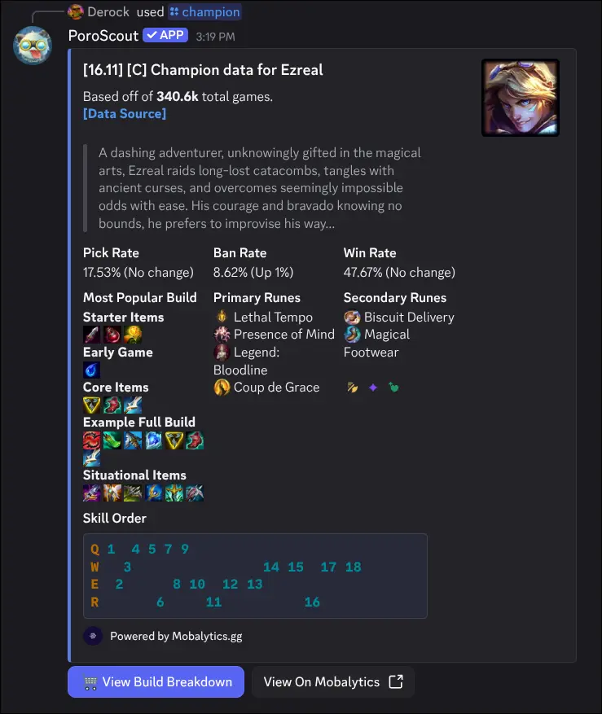

`/champion` gives you a data-driven snapshot of where a champion stands this patch, including their popular build, rune page, skill priority, and meta stats, all powered by [Mobalytics.gg](https://app.mobalytics.gg).

## What it shows

The embed header shows the current patch version, the champion's tier (if available), and how many total games the data is based on. The description includes a short blurb about the champion.

**Pick Rate, Ban Rate, and Win Rate** are each shown with a delta from the previous patch, so you can quickly tell whether a champion is trending up or down.

**Most Popular Build** lays out the recommended items in groups: Starter Items, Early Game, Core Items, and the full build path. Each group is labeled with item emojis for quick scanning.

**Primary Runes** lists the four choices from the primary tree, from the keystone down through the rows. **Secondary Runes** covers the two picks from the secondary tree along with the three stat shards.

**Skill Order** shows the recommended leveling sequence for Q, W, E, and R, displayed as a numbered progression so you can see exactly when to max each ability.

### Build Breakdown

Clicking **View Build Breakdown** opens a detailed item list as an ephemeral reply (only you can see it). It organizes items by phase: Starter, Early, Core, Situational, and Full Build, with timestamps where applicable (for example, "Core Items (at 15m)").

A **View On Mobalytics** link button takes you directly to the champion's Mobalytics page for the full interactive breakdown.

## Usage

```text
/champion champion:<champion>
/champion champion:<champion> role:<role>
```

| Option     | Required | Description                                                              |
| ---------- | -------- | ------------------------------------------------------------------------ |
| `champion` | Yes      | The champion to look up (autocompletes as you type).                     |
| `role`     | No       | The role/lane to filter build data for (Top, Jungle, Mid, ADC, Support). |

Specifying a role is useful for champions that are played in multiple positions, like Teemo or Senna, where builds differ significantly.

## Example



## Notes

- If data for the current patch is not available yet (typically right after a new patch drops), the embed shows a warning and falls back to the previous patch's data.
- Mobalytics is the source for all build and stats data. The footer credits the data source.

## Tips

- For ability details and lore, use [`/abilities`](/docs/commands/abilities) instead.
- Use the `role` option to get the right build when a champion is off-meta in a non-primary role.
- For a ranked tier list overview across all roles, use [`/best`](/docs/commands/best).
