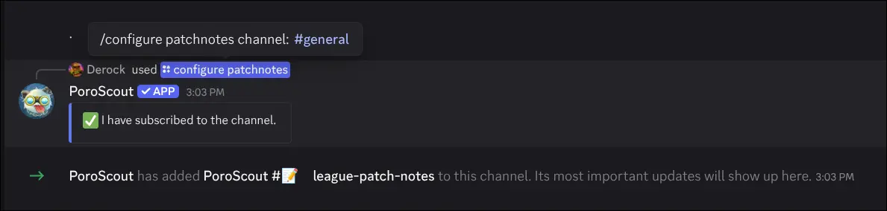

`/configure` is a server-only command restricted to members with the **Administrator** permission. It lets you wire up PoroScout to deliver automatic updates to a channel of your choice.

## Patch notes channel

```text
/configure patchnotes channel:<channel>
```

Subscribes a text channel to receive automatic patch notes every time a new League of Legends patch drops. Run the same command on the same channel a second time to unsubscribe.

| Option    | Required | Description                                     |
| --------- | -------- | ----------------------------------------------- |
| `channel` | Yes      | The text channel to subscribe (or unsubscribe). |

PoroScout needs the **Manage Webhooks** permission, both globally and in the target channel, to set this up. The bot will tell you if a permission is missing.

Channels must be standard text channels. News (announcement) channels and thread channels are not supported.

## Tournaments channel

```text
/configure tournaments channel:<channel> region:<region>
/configure tournaments channel:<channel> region:<region> role:<role>
```

Subscribes a text channel to receive updates for upcoming and ongoing tournaments in a specific region, powered by Leagues.GG. Run the same command again with the same channel and region to unsubscribe.

| Option    | Required | Description                                                                 |
| --------- | -------- | --------------------------------------------------------------------------- |
| `channel` | Yes      | The text channel to subscribe (or unsubscribe).                             |
| `region`  | Yes      | The region whose tournaments you want to follow.                            |
| `role`    | No       | A role to ping when updates are posted. Defaults to `@everyone` if omitted. |

Same permission requirements apply: PoroScout needs **Manage Webhooks** access in the target channel.

Each channel can be subscribed to multiple regions independently, and each subscription can have its own ping role.

## Example



## Tips

- If you want patch notes manually on demand instead of automatic delivery, use [`/patchnotes`](/docs/commands/patchnotes).
- If PoroScout cannot create the webhook (for example, it is missing permissions), the command will explain what is needed and provide a support server link as a fallback.
