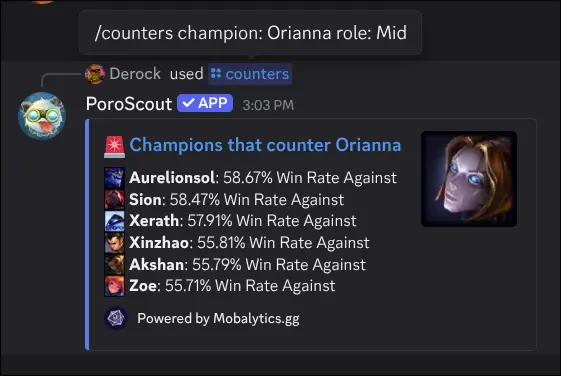

`/counters` lists the champions that statistically beat a given pick. Each entry shows the counter's win rate against the target champion, along with which role that matchup data comes from. Useful for draft prep or when you are figuring out what to ban.

## What it shows

The embed lists counter picks ranked by their win rate against the specified champion. Each entry includes:

- The **counter champion's icon and name**.
- The **role** the matchup applies to (when known).
- The **win rate** that champion achieves against your target.

The thumbnail shows the target champion's splash. A link to the full Mobalytics counters page is included at the bottom.

## Usage

```text
/counters champion:<champion>
/counters champion:<champion> role:<role>
```

| Option     | Required | Description                                                             |
| ---------- | -------- | ----------------------------------------------------------------------- |
| `champion` | Yes      | The champion you want to find counters for (autocompletes as you type). |
| `role`     | No       | Filter counter data to a specific role.                                 |

Adding a `role` narrows the matchup data to that lane, which matters for flex picks where the same champion might be countered differently in different positions.

## Example



## Tips

- For the flip side (who your champion beats), use [`/synergies`](/docs/commands/synergies) to find allies, or check the counter list of the enemy champion instead.
- Counter data comes from [Mobalytics.gg](https://mobalytics.gg) and reflects the current patch.
