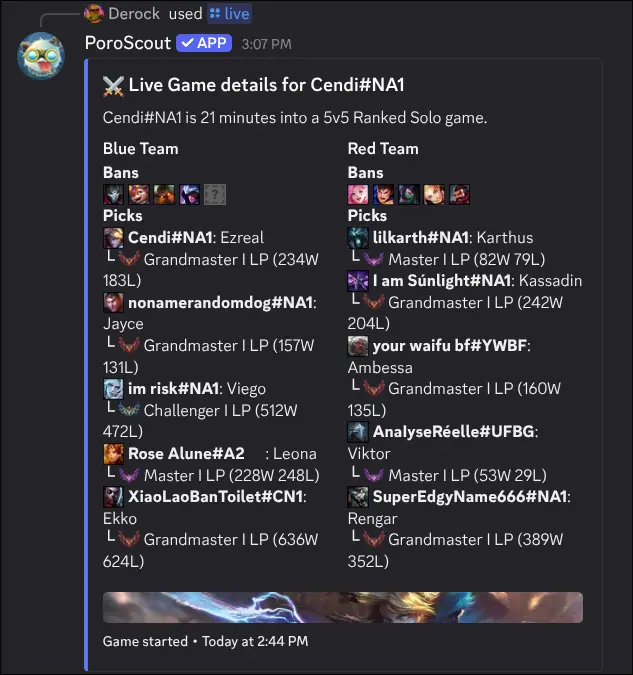

`/live` checks whether a player is in an active game and shows the full lobby breakdown if they are. It is useful for checking an opponent's team before a rematch, or for seeing what your friends are queueing into while you wait to join.

## What it shows

The embed header shows the player's name and how many minutes into the game they are, plus the queue type.

**Blue Team** and **Red Team** are shown side by side. Each player entry includes:

- **Champion icon** and **Riot ID** (GameName#Tag).
- **Champion name**.
- **Solo queue rank** with tier, division, LP, and win/loss record. Unranked players are labeled as such.

If bans were recorded for the game (Ranked and some other modes), they appear above each team's picks.

The embed timestamp shows when the game started.

## Usage

```text
/live
/live username:<RiotID#Tag> region:<region>
```

| Option     | Required | Description                                                                              |
| ---------- | -------- | ---------------------------------------------------------------------------------------- |
| `username` | No       | The Riot ID to look up. Leave blank to use your [linked account](/docs/linked-accounts). |
| `region`   | No       | The region the account is in. Required if providing a username without a link.           |

## Example



## Tips

- If the player is not in a game, the command returns an error rather than an empty embed.
- [`/profile`](/docs/commands/profile) also shows a brief "current game" status, but `/live` gives the full team breakdown.
- [Link your account](/docs/linked-accounts) so you can run `/live` with no arguments.
