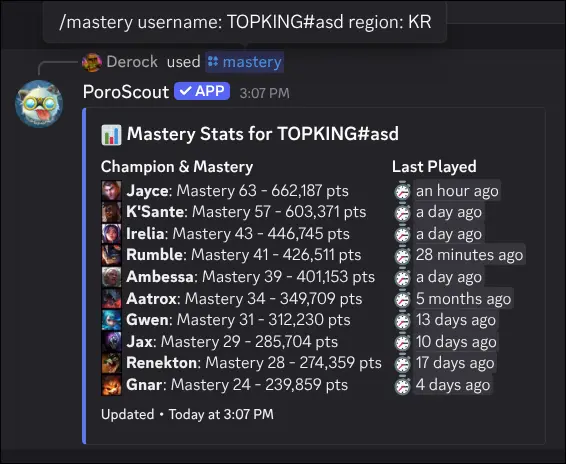

`/mastery` shows a player's top ten champions by mastery. Each entry shows the champion's mastery level, total mastery points, and how long ago it was last played.

## What it shows

The embed lists champions sorted from highest to lowest mastery level (ties are broken by mastery points). For each champion you get:

- **Champion icon and name** with the mastery level (M1 through M10+).
- **Total mastery points** formatted with commas for readability.
- **Last played** shown as a relative timestamp (for example, "3 days ago").

## Usage

```text
/mastery
/mastery username:<RiotID#Tag> region:<region>
```

| Option     | Required | Description                                                                              |
| ---------- | -------- | ---------------------------------------------------------------------------------------- |
| `username` | No       | The Riot ID to look up. Leave blank to use your [linked account](/docs/linked-accounts). |
| `region`   | No       | The region the account is in. Required if providing a username without a link.           |

## Example



## Tips

- `/profile` also shows a player's top five mastery champions as part of the full overview.
- [Link your account](/docs/linked-accounts) so you can run `/mastery` with no arguments.
