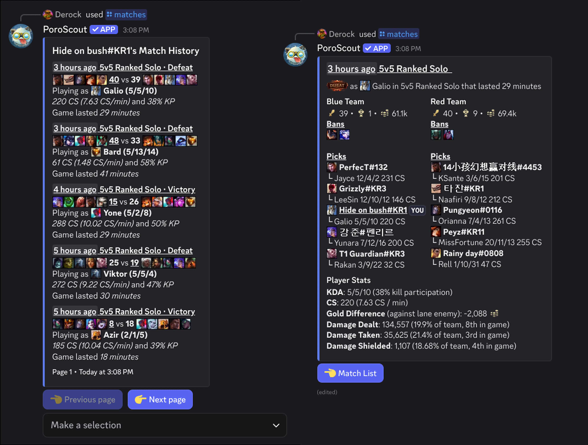

`/matches` shows a paginated match history. You get five games at a time, each summarized in the embed. You can then select any game from the dropdown to see a full breakdown, or page forward and backward through history.

## Match list view

Each entry in the match list shows:

- **When it was played** (relative timestamp) and the **queue type** (Ranked Solo, ARAM, Normal, etc.).
- **Result** (Victory or Defeat) and the picks for both teams.
- **Score** with your team's kill total underlined for reference.
- **Champion played** with KDA.
- **CS** total and CS per minute.
- **Kill participation** percentage.
- **Game duration**.

At the bottom of the embed, previous and next page buttons let you scroll through older games.

### Game dropdown

The select menu below the embed lists all five games on the current page. Selecting one switches to the **full match view** for that game.

## Full match view

When you select a game from the dropdown, the embed updates to show a complete breakdown of that match.

**Blue Team** and **Red Team** are shown side by side. Each side shows total kills, towers, and gold for the team, the champion bans (if applicable), and each player's name, champion, and KDA with CS count. Your own entry is underlined and marked with `YOU`.

**Player Stats** zooms in on your own performance:

- KDA with kill participation percentage.
- CS total and CS per minute.
- Gold difference against your lane opponent (positive means you were ahead).
- Damage dealt with your percentage of the team's total and your rank among all 10 players in the game.
- Damage taken with the same percentage and ranking.
- Damage shielded for ally teammates, with percentage and ranking.

A **Match List** button returns you to the game list.

## Arena support

Arena games (the 2v2v2v2 mode) are handled separately. The match list view shows your placement with a medal (gold for 1st, silver for 2nd, bronze for 3rd) and your champion and KDA alongside your duo partner's info.

The full Arena view lists all teams in placement order. Each team entry shows the players, their champions and KDAs, and which champions they banned. Your entry is marked with `YOU`. A Player Stats section shows your final items by name.

## Usage

```text
/matches
/matches username:<RiotID#Tag> region:<region>
```

| Option     | Required | Description                                                                              |
| ---------- | -------- | ---------------------------------------------------------------------------------------- |
| `username` | No       | The Riot ID to look up. Leave blank to use your [linked account](/docs/linked-accounts). |
| `region`   | No       | The region the account is in. Required if providing a username without a link.           |

## Example



## Tips

- The page buttons and game dropdown are only usable by the person who ran the command.
- If the session data expires (older menus), the buttons disable and prompt you to re-run the command.
- For a quick recent-game summary without pagination, [`/profile`](/docs/commands/profile) shows the last game and overall recent performance.
