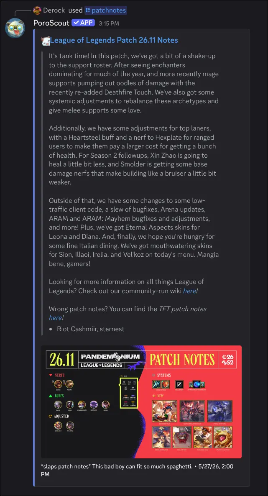

`/patchnotes` fetches the patch notes for the current patch (or any recent past patch you specify) and posts a summary embed with the title, description, authors, image, and a link to the full article.

## What it shows

The embed includes:

- The **patch title** (for example, "Patch 14.12 Notes").
- The **summary description** covering the main changes.
- The **authors** who wrote the notes, listed at the bottom of the description.
- The **patch artwork image** used in the official article.
- A **timestamp** with the patch publication date.
- A **link** to the full official patch notes page.

## Usage

```text
/patchnotes
/patchnotes version:<version>
```

| Option    | Required | Description                                                                              |
| --------- | -------- | ---------------------------------------------------------------------------------------- |
| `version` | No       | The patch to retrieve (for example, `14.11`). Autocompletes. Leave blank for the latest. |

The `version` field autocompletes as you type, so you can search by major and minor version number. Older versions may not be available.

## Example



## Tips

- To get patch notes automatically posted in your server every patch, set up the [`/configure patchnotes`](/docs/commands/configure) channel subscription.
- For a quick look at how a specific champion changed, combine this with [`/champion`](/docs/commands/champion) to see their updated stats and build.
