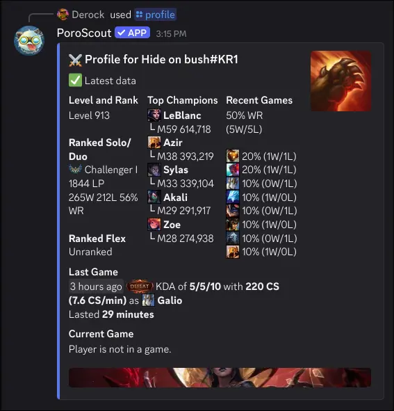

`/profile` is your all-in-one look at a summoner. It pulls rank, top champions by mastery, recent game performance, the most recent game in detail, and whether the player is currently in a game, all in a single embed.

## What it shows

**Level and Rank** lists the player's summoner level, followed by their Solo/Duo and Flex ranked standings. Each queue shows the tier, division, LP, and win/loss record with a win rate percentage.

**Top Champions** shows up to five champions sorted by mastery level. Each entry displays the champion's mastery level and total mastery points.

**Recent Games** summarizes the last several games with an overall win rate (X wins / Y losses), then breaks down how frequently each champion appeared during that stretch and the per-champion win/loss record.

**Last Game** covers the most recent match: when it was played, the result, KDA, CS count, CS per minute, and which champion was played, along with how long the game lasted.

**Current Game** shows whether the player is in an active game. If they are, it displays what champion they are playing and how many minutes into the game they are. If not, it simply says the player is not in a game.

The embed thumbnail is the splash art of the player's highest-mastery champion.

## Refreshing data

If the profile data is older than five minutes, a **Refresh Data** button appears below the embed. Clicking it fetches fresh data from Riot and updates the embed. Only the person who ran the command can trigger the refresh.

## Usage

```text
/profile
/profile username:<RiotID#Tag> region:<region>
```

| Option     | Required | Description                                                                              |
| ---------- | -------- | ---------------------------------------------------------------------------------------- |
| `username` | No       | The Riot ID to look up. Leave blank to use your [linked account](/docs/linked-accounts). |
| `region`   | No       | The region the account is in. Required if providing a username without a link.           |

## Example



## Tips

- For a detailed breakdown of mastery standings, use [`/mastery`](/docs/commands/mastery).
- For a paginated match history you can click through, use [`/matches`](/docs/commands/matches).
- To see a live game in more detail (team comps, bans, individual ranks), use [`/live`](/docs/commands/live).
- [Link your account](/docs/linked-accounts) to skip typing your username every time.
