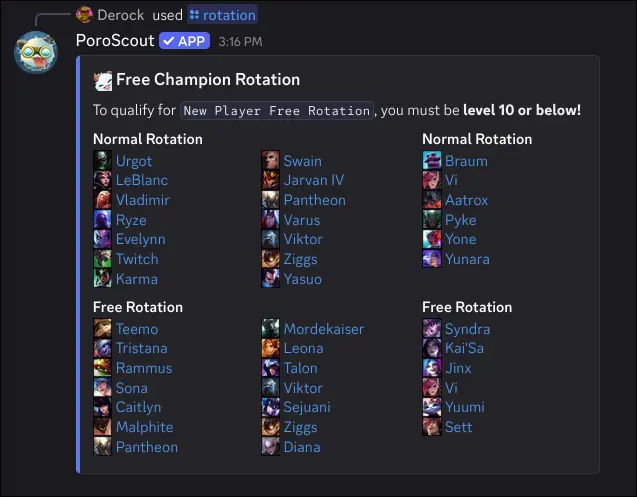

`/rotation` lists all champions currently available for free, split into two groups: the standard weekly rotation for all players, and the new player rotation for accounts below a certain level.

## What it shows

**Normal Rotation** is the standard free champion pool that rotates weekly. All accounts can play these champions regardless of level. Each champion is shown with their icon and a link to their Mobalytics page for builds.

**New Player Free Rotation** is a separate, more stable pool of beginner-friendly champions available to accounts that are below the level threshold shown in the embed description. If you are at or above that level, these champions are not available to you for free.

## Usage

```text
/rotation
```

No options needed. The rotation is global and does not vary by region.

## Example



## Tips

- The rotation updates each Tuesday with the weekly patch cycle.
- If you are trying out a champion from the rotation, run [`/champion`](/docs/commands/champion) to get the recommended build before you queue up.
- [`/abilities`](/docs/commands/abilities) is a good companion if you want to read up on a champion's kit before playing them.
