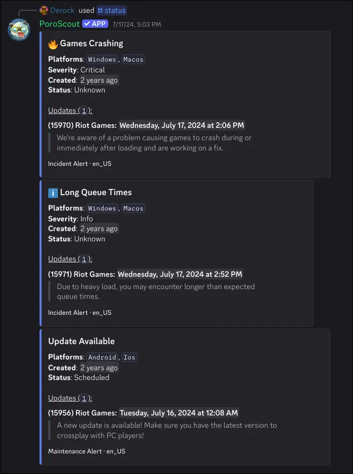

`/status` pulls the current Riot Games platform status for a given region. If everything is running normally, it says so. If there are active incidents or scheduled maintenances, each one gets its own embed with details.

## What it shows

When there are no issues, a single embed confirms the region is fully operational.

When incidents or maintenances exist, each one is shown as a separate embed with:

- **Title** of the incident or maintenance (localized to your Discord language when available).
- **Platforms affected** (for example, `Game`, `Client`).
- **Severity** for incidents: info, warn, or critical. Critical incidents are marked with a fire icon, warnings get a caution icon.
- **Created** relative timestamp.
- **Status** of the maintenance (for example, "In Progress", "Scheduled", "Complete").
- **Updated** timestamp, if the issue has received updates.
- **Updates log** showing each posted update with the author, timestamp, and their message.

The embed footer labels whether it is an incident or a maintenance, along with the locale of the text.

## Usage

```text
/status region:<region>
```

| Option   | Required | Description                            |
| -------- | -------- | -------------------------------------- |
| `region` | Yes      | The region to check (NA1, EUW1, etc.). |

## Example



## Tips

- If a command like `/profile` or `/matches` is returning errors unexpectedly, checking `/status` for your region is a good first step.
- Riot's status page at [status.riotgames.com](https://status.riotgames.com) is the same source of truth this command reads from.
