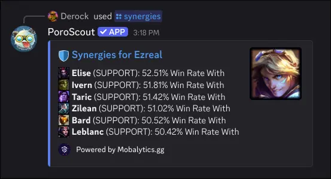

`/synergies` shows the champions that perform well when played alongside a given pick. Each entry includes the synergy partner, the role they play, and the win rate the duo achieves together.

## What it shows

The embed lists the best synergy partners in order of win rate. Each entry shows:

- The **ally champion's icon and name**.
- The **role** that champion is playing in the synergy matchup.
- The **win rate with** the target champion.

The thumbnail shows the target champion's splash. A link to the Mobalytics champion page is included for further exploration.

## Usage

```text
/synergies champion:<champion>
/synergies champion:<champion> role:<role>
```

| Option     | Required | Description                                                     |
| ---------- | -------- | --------------------------------------------------------------- |
| `champion` | Yes      | The champion to find synergies for (autocompletes as you type). |
| `role`     | No       | Filter synergy data to a specific role for the target champion. |

## Example



## Tips

- For the opposite perspective (who beats your champion), use [`/counters`](/docs/commands/counters).
- Data is sourced from [Mobalytics.gg](https://mobalytics.gg).
