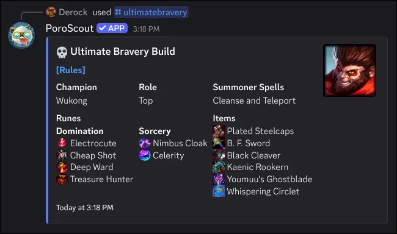

`/ultimatebravery` rolls a completely random build for a random champion. It follows the spirit of [Ultimate Bravery](https://www.ultimate-bravery.net/Rules): you must play whatever comes up, no rerolls.

## What it shows

Each roll generates:

- **Champion** selected at random from the full champion pool.
- **Role** (Top, Jungle, Mid, ADC, or Support), also random.
- **Summoner Spells**: two random spells. If the role is Jungle, one spell is always Smite.
- **Primary Runes**: a random keystone and three row selections from a randomly chosen primary tree.
- **Secondary Runes**: two row selections from a different randomly chosen secondary tree.
- **Items**: boots, a first item, and four additional items, all random. Duplicate items are avoided within the same roll.

The embed thumbnail shows the splash art of the rolled champion.

## Usage

```text
/ultimatebravery
```

No options. Every result is generated fresh each time.

## Example



## Tips

- The **Rules** link in the embed description explains what you are obligated to honor when playing Ultimate Bravery.
- If you want a real recommended build instead, use [`/champion`](/docs/commands/champion).
